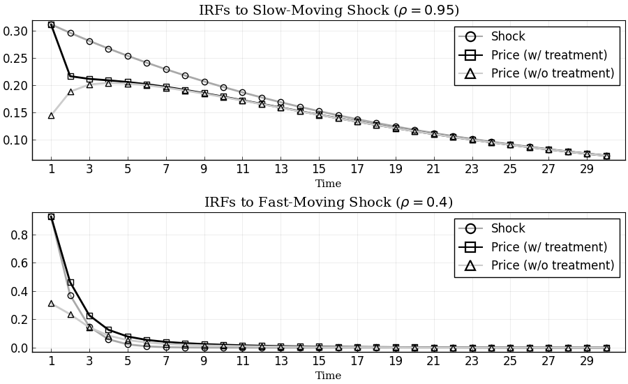

```@meta
EditURL = "<unknown>/examples/ex4_Sims_2011.jl"
```

# Replication of Sims (2011)

This example replicates [Sims (2011)](http://sims.princeton.edu/yftp/RIMP/handbookChapterRI2.pdf) from the Handbook of Monetary Economics using the [DRIPs](https://github.com/afrouzi/DRIPs) package.

[](https://mybinder.org/v2/gh/choongryulyang/dynamic_multivariate_RI/master?filepath=Julia) to run and modify the following code (no software is needed on the local machine).

See [Afrouzi and Yang (2019)](http://www.afrouzi.com/dynamic_inattention.pdf) for background on the theory.

## Contents
* [Setup](@ref sims2011_setup)
* [Initialization](@ref sims2011_param)
* [Solution](@ref sims2011_solution)
    * [Benchmark Parameterization](@ref sims2011_benchmark)
    * [Lower Cost of Attention: $\omega = 0.1$](@ref sims2011_lowomega)
    * [Other Discount Factors: $\beta \in \{0,1\}$](@ref sims2011_betas)
* [Impulse Response Functions](@ref sims2011_figures)
    * [Benchmark Parameterization](@ref sims2011_fig_benchmark)
    * [Lower Cost of Attention: $\omega = 0.1$](@ref sims2011_fig_lowomega)
    * [Other Discount Factors: $\beta \in \{0,1\}$](@ref sims2011_fig_betas)
* [Extensions](@ref sims2011_extensions)
    * [Transition Dynamics of Attention](@ref sims2011_trip)
    * [Impulse Response Functions with Information Treatment](@ref sims2011_trip_irfs)

## [Setup](@id sims2011_setup)

The problem in [Sims (2011)](http://sims.princeton.edu/yftp/RIMP/handbookChapterRI2.pdf), as it appears on page 21, with slight change of notation,
```math
\begin{aligned}
            & \min_{\{\Sigma_{t|t}\succeq 0\}_{t\geq 0}} \mathbb{E}_0\left[\sum_{t=0}^\infty
  \beta^t \left(tr(\Sigma_{t|t}\mathbf{H}\mathbf{H}')+\omega\log\left(\frac{|\Sigma_{t|t-1}|}{|\Sigma_{t|t}|}\right)\right)\right] \\
  s.t.\quad &
  \Sigma_{t+1|t}=\mathbf{A}\Sigma_{t|t}\mathbf{A}'+\mathbf{Q}\mathbf{Q}'\\
            & \Sigma_{t|t-1}-\Sigma_{t|t} \text{ positive semi-definite}
\end{aligned}
```

where
```math
\begin{aligned}
  \mathbf{H} = \left[\begin{array}{c} 1 \\ 1\end{array}\right],
    \quad
    \mathbf{A} = \left[\begin{array}{cc}
                          0.95 & 0\\
                          0 & 0.4\\
                     \end{array}\right],
  \quad
  \mathbf{Q} = \left[\begin{array}{cc}
                          \sqrt{0.0975} & 0\\
                          0           & \sqrt{0.86}\\
                     \end{array}\right]
\end{aligned}
```
We have renamed the parameters so that the problem directly maps to a D.R.I.P. Otherwise, the problem is the same.

## [Initialization](@id sims2011_param)
Include the package:

```julia
using DRIPs;
nothing #hide
```

Set parameters:

```julia
β = 0.9;
ω = 1.0;
A = [0.95 0.0; 0.0 0.4];
Q = [√0.0975 0.0; 0.0 √0.86];
H = [1.0; 1.0];
nothing #hide
```

## [Solution and Performance](@id sims2011_solution)
### [Benchmark Parameterization](@id sims2011_benchmark)
Solve and display the optimal posterior covariance matrix:

```julia
sol_bp = solve_drip(ω,β,A,Q,H);
sol_bp.Σ_p
```

```
2×2 LinearAlgebra.Symmetric{Float64,Array{Float64,2}}:
  0.359213  -0.177025
 -0.177025   0.794584
```

Performance for random values of $\omega\in [0,2]$:

```julia
using BenchmarkTools;
@benchmark solve_drip(ω,β,A,Q,H) setup = (ω = 2*rand())
```

```
BenchmarkTools.Trial: 
  memory estimate:  176.06 KiB
  allocs estimate:  1545
  --------------
  minimum time:     102.218 μs (0.00% GC)
  median time:      115.439 μs (0.00% GC)
  mean time:        145.847 μs (19.24% GC)
  maximum time:     9.079 ms (97.59% GC)
  --------------
  samples:          10000
  evals/sample:     1
```

Performance for random values of $\beta\in[0,1]$:

```julia
@benchmark solve_drip(ω,β,A,Q,H) setup = (β = rand())
```

```
BenchmarkTools.Trial: 
  memory estimate:  176.06 KiB
  allocs estimate:  1545
  --------------
  minimum time:     99.666 μs (0.00% GC)
  median time:      123.752 μs (0.00% GC)
  mean time:        153.173 μs (18.61% GC)
  maximum time:     8.484 ms (98.03% GC)
  --------------
  samples:          10000
  evals/sample:     1
```

### [Lower Cost of Attention: $\omega = 0.1$](@id sims2011_lowomega)
Solve and display the optimal posterior covariance matrix:

```julia
sol_lω = solve_drip(0.1,β,A,Q,H);
sol_lω.Σ_p
```

```
2×2 LinearAlgebra.Symmetric{Float64,Array{Float64,2}}:
  0.319919  -0.304142
 -0.304142   0.386163
```

### [Different Discount Factors: $\beta \in \{0,1\}$](@id sims2011_betas)
Solve the model for $\beta=0$ and $\beta=1$ to compare with the benchmark value of $\beta=0.9$:

``\beta = 0``

```julia
sol_lβ = solve_drip(ω,0,A,Q,H);
sol_lβ.Σ_p
```

```
2×2 LinearAlgebra.Symmetric{Float64,Array{Float64,2}}:
  0.495403  -0.152171
 -0.152171   0.808939
```

``\beta = 1``:

```julia
sol_hβ = solve_drip(ω,1,A,Q,H);
sol_hβ.Σ_p
```

```
2×2 LinearAlgebra.Symmetric{Float64,Array{Float64,2}}:
  0.337666  -0.178019
 -0.178019   0.799701
```

## [Impulse Response Functions](@id sims2011_figures)
### [Benchmark Parameterization](@id sims2011_fig_benchmark)
Get the IRFs:

```julia
T = 25;
irfs_bp = dripirfs(sol_bp,T = T);
nothing #hide
```

Plot IRFs:

```julia
using Plots, LaTeXStrings; pyplot();
p1 = plot(1:T, [irfs_bp.x[1,1,:], irfs_bp.a[1,1,:]],
    title             = L"IRFs to Slow-Moving Shock ($\rho = 0.95$)",
    label             = ["Shock" "Price"],
    color             = [:darkgray :black],
    marker            = [:circle :square],
    markerstrokecolor = :match,
    markercolor       = false,
    markersize        = 6)
p2 = plot(1:T, [irfs_bp.x[2,2,:], irfs_bp.a[1,2,:]],
    title             = L"IRFs to Fast-Moving Shock ($\rho = 0.4$)",
    label             = ["Shock" "Price"],
    color             = [:darkgray :black],
    marker            = [:circle :square],
    markerstrokecolor = :match,
    markercolor       = false,
    markersize        = 6)
p = plot(p1,p2,
    layout     = (2,1),
    xlabel     = "Time",
    lw         = 2,
    xticks     = (1:2:T),
    xlim       = (0,T+1),
    fontfamily = "serif",
    legend     = :topright,
    legendfont = font(12),
    tickfont   = font(12),
    size       = (900,550),
    framestyle = :box)
```


### [Lower Cost of Attention: $\omega=0.1$](@id sims2011_fig_lowomega)
Get the IRFs:

```julia
T = 25; #length of IRFs
irfs_lω = dripirfs(sol_lω,T = T);
nothing #hide
```

Plot IRFs:

```julia
p1 = plot(1:T, [irfs_lω.x[1,1,:], irfs_lω.a[1,1,:]],
    title             = L"IRFs to Slow-Moving Shock ($\rho = 0.95$)",
    label             = ["Shock" "Price"],
    color             = [:darkgray :black],
    marker            = [:circle :square],
    markerstrokecolor = :match,
    markercolor       = false,
    markersize        = 6)
p2 = plot(1:T, [irfs_lω.x[2,2,:], irfs_lω.a[1,2,:]],
    title             = L"IRFs to Fast-Moving Shock ($\rho = 0.4$)",
    label             = ["Shock" "Price"],
    color             = [:darkgray :black],
    marker            = [:circle :square],
    markerstrokecolor = :match,
    markercolor       = false,
    markersize        = 6)
p = plot(p1,p2,
    layout     = (2,1),
    xlabel     = "Time",
    lw         = 2,
    xticks     = (1:2:T),
    xlim       = (0,T+1),
    fontfamily = "serif",
    legend     = :topright,
    legendfont = font(12),
    tickfont   = font(12),
    size       = (900,550),
    framestyle = :box)
```


### [Other Discount Factors: $\beta\in\{0,1\}$](@id sims2011_fig_betas)
Get the IRFs:

```julia
T = 25; #length of IRFs
irfs_lβ = dripirfs(sol_lβ,T = T);
irfs_hβ = dripirfs(sol_hβ,T = T);
nothing #hide
```

Plot IRFs:

```julia
p1 = plot(1:T, [irfs_bp.x[1,1,:],irfs_hβ.a[1,1,:], irfs_lβ.a[1,1,:]],
    title             = L"IRFs to Slow-Moving Shock ($\rho = 0.95$)",
    label             = ["Shock" L"Price ($\beta=1$)" L"Price ($\beta=0$)"],
    color             = [:darkgray :black :gray50],
    marker            = [:circle :square :utriangle],
    markerstrokecolor = :match,
    markercolor       = false,
    markersize        = 6)
p2 = plot(1:T, [irfs_bp.x[2,2,:],irfs_hβ.a[1,2,:], irfs_lβ.a[1,2,:]],
    title             = L"IRFs to Fast-Moving Shock ($\rho = 0.4$)",
    label             = ["Shock" L"Priceblack ($\beta=1$)" L"Price ($\beta=0$)"],
    color             = [:darkgray :black :gray50],
    marker            = [:circle :square :utriangle],
    markerstrokecolor = :match,
    markercolor       = false,
    markersize        = 6)
p = plot(p1,p2,
    layout     = (2,1),
    xlabel     = "Time",
    lw         = 2,
    xticks     = (1:2:T),
    xlim       = (0,T+1),
    fontfamily = "serif",
    legend     = :topright,
    legendfont = font(12),
    tickfont   = font(12),
    size       = (900,550),
    framestyle = :box)
```


## [Extensions](@id sims2011_extensions)

### [Transition Dynamics of Attention](@id sims2011_trip)

In this section, we solve for the transition dynamics of the optimal posterior covariance matrix starting from an initial prior that is different from the steady state prior.

For instance let us consider a case where the firm is at the steady state of the rational inattention problem at time 0, with prior covariance matrix $\bar{\Sigma}_{-1}$, and it receives a one time treatment with a perfectly informative signal about its optimal price:

$$s_0 = \mathbf{H}'\vec{x}_0$$

#### Solve for the transition dynamics
The function `solve_trip` solves for the transition dynamics automatically given the initial signal. Start by initializing the initial signal:

```julia
s0 = Signal(H,0.0);
nothing #hide
```

Solve for the transition dynamics given $s_0$:

```julia
Tss     = 15; # guess for time until convergence
bp_trip = solve_trip(sol_bp, s0; T = Tss);
nothing #hide
```

Performance for solving the transition dynamics for a random signal:

```julia
@benchmark solve_trip(sol_bp, S; T = 30) setup = (S = Signal(rand(2),0.0))
```

```
BenchmarkTools.Trial: 
  memory estimate:  751.52 KiB
  allocs estimate:  6443
  --------------
  minimum time:     680.084 μs (0.00% GC)
  median time:      860.913 μs (0.00% GC)
  mean time:        1.001 ms (13.56% GC)
  maximum time:     11.834 ms (92.98% GC)
  --------------
  samples:          4982
  evals/sample:     1
```

#### Plot Transition Path of Eigenvalues

Plot the marginal values of information. In this problem the state is two dimensional. At any time, for every orthogonalized dimension, the agent weighs the **marginal value** of acquiring information in that dimension against the **marginal cost** of attention which is the parameter $\omega$.**The number of signals that the agent acquires at any time is the number of marginal values that are larger than $\omega$.**

```julia
p = plot(0:Tss-1,[bp_trip.Ds[1,1:Tss],bp_trip.Ds[2,1:Tss],bp_trip.P.ω*ones(Tss,1)],
    label             = ["Low marginal value dim." "High marginal value dim." "Marginal cost of attention"],
    size              = (900,275),
    title             = "Marginal Value of Information",
    xlabel            = "Time",
    color             = [:darkgray :black :black],
    line              = [:solid :solid :dash],
    marker            = [:circle :square :none],
    markercolor       = false,
    markerstrokecolor = :match,
    markersize        = 6,
    xlim              = (-1,Tss),
    xticks            = 0:2:Tss-1,
    legend            = :outertopright,
    fontfamily        = "serif",
    framestyle        = :box)
```


### [Impulse Response Functions with Information Treatment](@id sims2011_trip_irfs)
Get the IRFs in the transition path after treatment:

```julia
T = 30;

tirfs_bp = dripirfs(sol_bp,s0,T = T); # irfs with treatment
irfs_bp  = dripirfs(sol_bp,T = T);    # irfs in the Ss (without treatment)
nothing #hide
```

Plot IRFs:

```julia
p1 = plot(1:T, [irfs_bp.x[1,1,:], tirfs_bp.a[1,1,:], irfs_bp.a[1,1,:]],
    title             = L"IRFs to Slow-Moving Shock ($\rho = 0.95$)",
    label             = ["Shock" "Price (w/ treatment)" "Price (w/o treatment)"],
    color             = [:darkgray :black :gray80],
    marker            = [:circle :square :utriangle],
    markerstrokecolor = :match,
    markercolor       = false,
    markersize        = 6)
p2 = plot(1:T, [tirfs_bp.x[2,2,:], tirfs_bp.a[1,2,:], irfs_bp.a[1,2,:]],
    title             = L"IRFs to Fast-Moving Shock ($\rho = 0.4$)",
    label             = ["Shock" "Price (w/ treatment)" "Price (w/o treatment)"],
    color             = [:darkgray :black :gray80],
    marker            = [:circle :square :utriangle],
    markerstrokecolor = :match,
    markercolor       = false,
    markersize        = 6)
p = plot(p1,p2,
    layout     = (2,1),
    xlabel     = "Time",
    lw         = 2,
    xticks     = (1:2:T),
    xlim       = (0,T+1),
    fontfamily = "serif",
    legend     = :topright,
    legendfont = font(12),
    tickfont   = font(12),
    size       = (900,550),
    framestyle = :box)
```


---

*This page was generated using [Literate.jl](https://github.com/fredrikekre/Literate.jl).*

